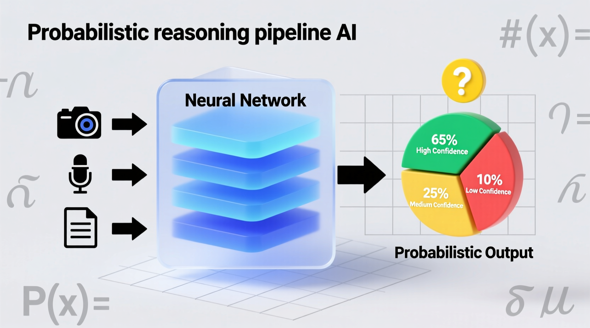
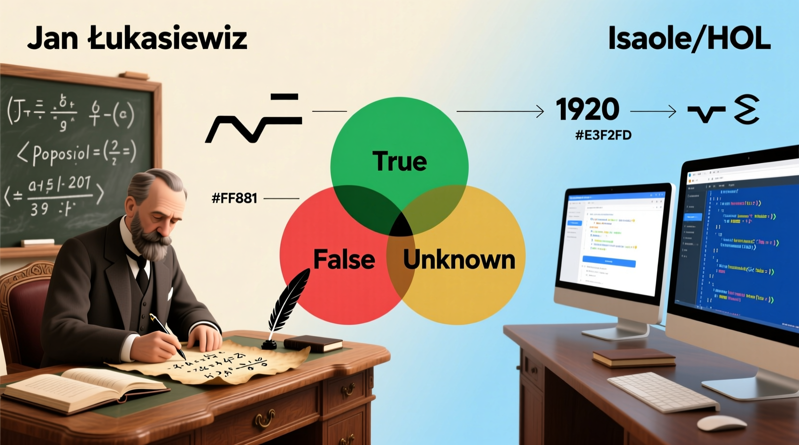
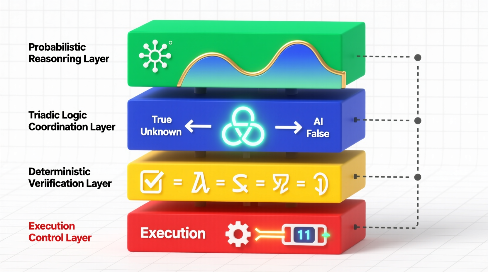

# Triadic Decision Pipelines

Architectural research on triadic coordination layers for artificial intelligence. This repository explores integrating a discrete third state (verification pending) between probabilistic neural generation and deterministic binary execution to resolve uncertainty in precision-critical AI decision pipelines.

## Executive Summary: Bridging Probabilistic Cognition and Deterministic Verification

The rapid expansion of artificial intelligence into critical infrastructure, financial markets, and healthcare has exposed a profound structural limitation in the foundational logic underlying automated decision-making. Historically, computational systems and formal execution gates have relied upon strict bivalent logic, restricting the final evaluation of any process to strictly *true* or *false*, *permitted* or *denied*. 

While continuous probabilistic reasoning models, deep neural networks, and Bayesian inference engines allow AI systems to process vast gradients of certainty, the execution phase of these systems almost inevitably collapses into a binary threshold. 

This forced collapse presents a severe architectural vulnerability. It routinely forces high-ambiguity transactions into either permissive states to maintain operational liquidity and throughput, or restrictive states that completely stall system utility. When systems are forced to round a 51% confidence score up to a definitive "True," they strip away the epistemic nuance of the original probabilistic inference, often leading to catastrophic failure modes such as unverified hallucinations, overconfident errors, and systemic gridlock in multi-agent networks.

This repository investigates the technical hypothesis that **triadic logical structures** can function as a crucial coordination layer. By explicitly separating epistemic ambiguity from immediate binary execution, triadic coordination layers prevent cascading errors and provide deterministic triggers for human-in-the-loop oversight.

### The Historical Continuum of Three-Valued Systems

The conceptualization of a third logical state possesses a rich, mathematically rigorous theoretical lineage. The earliest recorded departure from strict bivalent logic in formal systems began with the American pragmatist and logician Charles Sanders Peirce around 1909. Peirce explicitly postulated three truth values to handle boundary conditions and mathematical continuity: *Verum* (truth), *Falsum* (falsity), and the *Limit* (the third state).

Following Peirce, formal three-valued systems were published independently by Jan Łukasiewicz in 1920. Łukasiewicz was motivated by the philosophical problem of future contingents—recognizing that statements about future events are neither determinately true nor determinately false at the present moment. 

Stephen Kleene later introduced his own three-valued logics motivated by the realities of computational procedures. In Kleene's strong logic, a procedural function may yield a True or False output, but it may also fail to terminate or resolve, resulting in an *undefined* or *unknown* state. 

While these classical models viewed the third state primarily as a descriptive semantic category for unknown or continuous boundary conditions, modern AI requires these states to be operationalized as active control signals.

### The Goukassian Frameworks: Ternary Logic (TL) and Ternary Moral Logic (TML)

The core of this repository centers on the contemporary applied evolution of these classical mathematical systems proposed by Lev Goukassian through **Ternary Logic (TL)** and **Ternary Moral Logic (TML)**. 

Goukassian reframes the third state as an active, mandatory architectural mechanism for AI governance. In these frameworks, the logical structure utilizes three distinct operational values: *Proceed* (+1), *Halt* (-1), and the *Epistemic Hold* or *Sacred Zero* (0).

Unlike Kleene's *undefined* state, which passively observes that a computation has not yet terminated, the Epistemic Hold is a prescriptive operational trigger. It actively enforces a deterministic deliberative pause within the computational system. When internal uncertainty exceeds a defined statistical threshold, the system is architecturally forbidden from collapsing the decision into a forced binary guess. 

Instead, the AI system must hold its state, generate an immutable cryptographic log detailing the parameters of the uncertainty (the "No Log = No Action" mandate), and escalate the decision to an external oracle, a secondary heuristic layer, or a human steward. This transitions the third logical state from a descriptive condition of epistemology into an actionable, legally auditable mechanism for accountability.

### The Dual-Lane Architecture and Multi-Agent Safety

A significant architectural innovation detailed in these reports is the **Dual-Lane Architecture**, which resolves the friction between high-speed inference and deep verification:
1. **The Fast Lane (Inference):** Operates at extreme velocity (sub-2 milliseconds) utilizing highly optimized probabilistic models to evaluate incoming data streams. High-confidence data is processed immediately.
2. **The Slow Lane (Governance & Verification):** Handles the exceptions. If the Fast Lane encounters ambiguity, it triggers the Epistemic Hold state and routes the decision package to the asynchronous verification lane for deeper querying, formal proofing, and cryptographic anchoring.

Furthermore, embedding triadic evaluation gates between distinct agents in unstructured multi-agent networks fundamentally prevents "hallucination cascades"—situations where one agent passes a low-confidence assumption downstream, causing a subsequent agent to treat it as a verified fact.

Through a comprehensive review of these frameworks, hardware implementation constraints (including ternary LLMs and FPGAs), and comparative uncertainty mechanisms, this repository charts the future of multi-layer reasoning architectures that unify neural pattern recognition with rigorous, multi-valued verification.

---

## Repository Artifacts and Documentation

This repository contains five core deep research reports generated to analyze the architecture, implementation, and theoretical defense of triadic decision pipelines. The artifacts are available in Markdown, HTML, specialized Infographics (`-I.html`), Web Pages (`-W.html`), and Audio formats (`.mp3`).

### 1. Bridging Probabilistic Reasoning and Deterministic Verification
Analyzes the historical lineage from Peirce, Łukasiewicz, and Kleene to Goukassian's applied frameworks, evaluating the placement of triadic gates against existing Bayesian and abstention-based uncertainty methods.
* **Text:** [View Markdown](Bridging_Probabilistic_Reasoning_and_Deterministic_Verification.md)
* **Web:** [View HTML](https://fractonicmind.github.io/Triadic_Decision_Pipelines/Bridging_Probabilistic_Reasoning_and_Deterministic_Verification.html)

### 2. Triadic Logical Structures as a Coordination Layer for Uncertainty Management
Focuses on the deployment of triadic logic in high-stakes environments, detailing operational scenarios such as preventing flash crashes in algorithmic trading and enabling safe escalation in medical diagnostics.
* **Text:** [View Markdown](Triadic_Logical_Structures_as_a_Coordination_Layer_for_Uncertainty_Management.md)
* **Web Page:** [View Web Document](https://fractonicmind.github.io/Triadic_Decision_Pipelines/Triadic_Logical_Structures_as_a_Coordination_Layer_for_Uncertainty_Management-W.html)
* **Infographic:** [View Infographic](https://fractonicmind.github.io/Triadic_Decision_Pipelines/Triadic_Logical_Structures_as_a_Coordination_Layer_for_Uncertainty_Management-I.html)
* **Audio:** [Listen to MP3](https://fractonicmind.github.io/Triadic_Decision_Pipelines/Triadic_Logical_Structures_as_a_Coordination_Layer_for_Uncertainty_Management.mp3)

### 3. Triadic Logical Structures as Coordination Layers in Artificial Intelligence Architectures
Explores the structural vulnerabilities of unstructured multi-agent networks and positions the Dual-Lane Architecture as the definitive solution for containing cascading errors. 
* **Text:** [View Markdown](Triadic_Logical_Structures_as_Coordination_Layers_in_Artificial_Intelligence_Architectures.md)
* **Web Page:** [View Web Document](https://fractonicmind.github.io/Triadic_Decision_Pipelines/Triadic_Logical_Structures_as_Coordination_Layers_in_Artificial_Intelligence_Architectures-W.html)
* **Infographic:** [View Infographic](https://fractonicmind.github.io/Triadic_Decision_Pipelines/Triadic_Logical_Structures_as_Coordination_Layers_in_Artificial_Intelligence_Architectures-I.html)
* **Audio:** [Listen to MP3](https://fractonicmind.github.io/Triadic_Decision_Pipelines/Triadic_Logical_Structures_as_Coordination_Layers_in_Artificial_Intelligence_Architectures.mp3)

### 4. Triadic Logical Structures as Coordination Mechanisms in AI Architectures
A highly technical evaluation of state transition mechanics between inference and execution, detailing the "Sacred Zero" hardware pause and cryptographic logging requirements.
* **Text:** [View Markdown](Triadic_Logical_Structures_as_Coordination_Mechanisms_in_AI_Architectures.md)
* **Web:** [View HTML](https://fractonicmind.github.io/Triadic_Decision_Pipelines/Triadic_Logical_Structures_as_Coordination_Mechanisms_in_AI_Architectures.html)

---

### License
This work is licensed under a Creative Commons Attribution 4.0 International License (CC BY 4.0).
